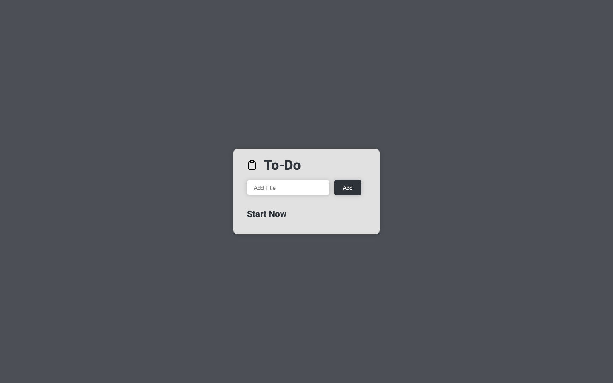

# To-do list

A to-do list in plain JavaScript and Sass. Add, edit and delete items in the browser. This was one of my first web projects, built in August 2023.

**Live site:** https://todo-sass.julianzaw.me



## Status

Complete. Items live only in the page and reset on reload.

## What it does

- Adds an item from the input box.
- Edits an item in a pop-up.
- Deletes an item.

## Tech stack

- HTML, Sass and vanilla JavaScript with DOM APIs
- An npm-scripts build: Sass, PostCSS (Autoprefixer, cssnano) and Browser-Sync

## Run it locally

```bash
npm install
npm start
```

`npm start` copies the source into `dist/`, watches for changes and serves the site with Browser-Sync. `npm run build` produces a minified build.

A later version with accounts and a database is in [todo-app](https://github.com/julianthant/todo-app).
